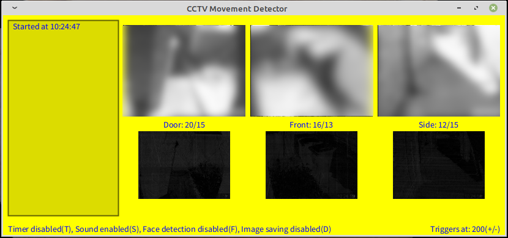

# imageChangeMonitor
Processing sketch to monitor cctv cameras for movement

Grabs images as a jpg file via a URL and compares it to the previous one, if it detects significant change it can make a warning sound, save the captured images etc.  
Most ip cameras have the ability to access them as a jpg image or an esp32cam module can be used via my demo sketch: https://github.com/alanesq/esp32cam-demo

It can act upon several cameras at the same time and is easily modifiable to your own requirements

Note: You can learn all about Processing from: https://thecodingtrain.com/

https://github.com/alanesq/imageChangeMonitor
